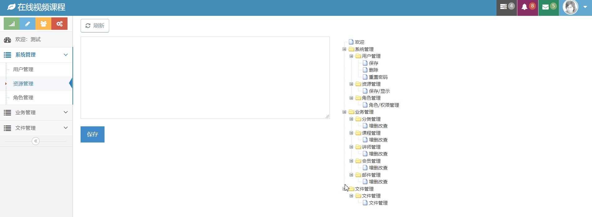

# 视频教学播放平台项目
这是一个基于前后端分离开发的视频播放项目，采用springcloud+vue的架构实现。
采用阿里云存储图片以及视频，采用视频点播服务防盗链。
分为两个平台，8080端口为内部管理平台，而8081端口为对外开发平台。

## 实现功能
内部管理平台：
1.权限管理
2.资源管理
3.新增用户
4.管理教师资料
5.上传教学视频
6.课程标签管理

外部平台：
1.注册（基于邮件验证）
2.登录
3.查看课程（课程分大章，大章分小节，一小节可以有一个视频）
4.免费课程可直接观看，收费课程需报名后才可观看。

## 环境说明
- JDK1.8
- maven3.6
- redis2.8.9
- mysql8.0+
- vue/cli 4.4.6 (vue版本估计基于3也行，有vue环境的同学可以先尝试npm install，出错再升级vue)

## 项目目录
admin目录为内部管理平台的vue项目
web目录为外部平台的vue项目
doc目录为项目文档目录，里面包含sql文件。

## 项目运行效果
### 内部管理平台

### 外部平台

